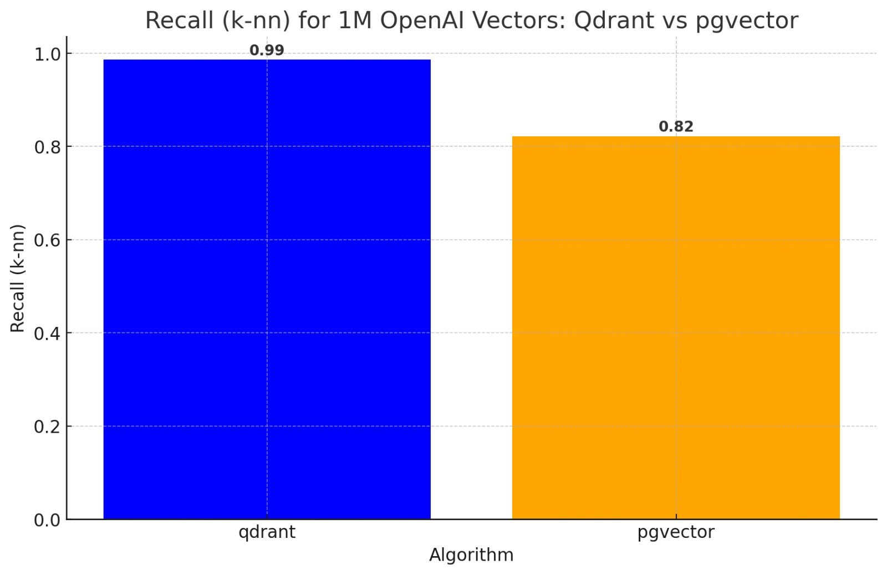

+++
title =  "Qdrant vs pgvector - Results from the 1M OpenAI Benchmark"
date = 2023-06-30T00:00:18+05:30
tags = ["tech", "machine learning", "production ml"]
featured_image = "/images/1M_QPS.jpeg"
description = "Consider This Before Using pgvector in Production"
toc = true
show_reading_time = true
social_preview_image = "/images/1M_QPS.jpeg"
+++

You may have considered using PostgreSQL's `pgvector` extension for vector similarity search. There are good reasons why this option is **strictly inferior** to dedicated vector search engines, such as [Qdrant](https://qdrant.tech/).

We ran both benchmarks using the [vectordb framework](https://github.com/qdrant/vector-db-benchmark) solely dedicated to processing vector data. The difference in performance is quite staggering. 

## Query Speed


Final results show that `pgvector` lags behind Qdrant by a factor of 15 when it comes to throughput.  

That is a 1500% deficit in speed. However, we shouldn't only consider speed as the main metric when evaluating a database. In terms of accuracy, `pgvector` delivers way fewer relevant results than Qdrant.

## Workload

Interestingly, these disparities start to surface with as few as 100,000 chunked documents. 


As an ardent supporter of PostgreSQL, it is disheartening to witness that `pgvector` doesn't just commence at under half the QPS at 100,000 vectors, when compared to Qdrant - it plunges precipitously beyond that. 


## Correctness 

One might try to rationalize this by assuming that Postgres is slower, but more accurate? Data reveals that `pgvector` is not just slower, but also ~18% less accurate!



We measure this using the same methodology as the [ann-benchmarks](https://ann-benchmarks.com) codebase: k-NN bruteforce as ground truth.

## Latency

Here, Qdrant holds its own. The worst p95 latency for Qdrant is 2.85s, a stark contrast to pgvector, whose best p95 latency is a full 4.02s. Even more astonishing, pgvector's worst p95 latency skyrockets to an unbelievable 45.46s.

## Benchmark Specs

The Machine we used to run the benchmark: `t3.2xlarge, 8 vCPU, 32GB RAM`

For data enthusiasts among us, this Google Sheet details all the numbers for a more in-depth analysis: [Google Sheet](https://docs.google.com/spreadsheets/d/1t2-tXID2LJCXdLv1JTPQaYhmMs6woOnK7W7nkEuDsUc/edit?usp=sharing)

## Configuration 

We use the default configuration for Qdrant and much better parameters for pgvector:

```
Qdrant(quantization=False, m=16, ef_construct=128, grpc=True, hnsw_ef=None, rescore=True)
```

```
PGVector(lists=200, probes=2)
```

The `pgvector` [recommendation]((https://github.com/pgvector/pgvector#query-options)) which'd be possibly worse performance-wise:
```
PGVector(lists=1000, probes=1)
```

There is much more to be tested. We will continue to explore the configuration space for both platforms and update this. 

## Conversations with the Community

Paul Copplestone (CEO, Supabase) has also shared his [thoughts on the matter](https://twitter.com/kiwicopple/status/1674395120395747331):
 
> Yup:
>1. Wait 6 months, a lot of development is happening on pgvector
>2. Use hybrid search
>3. Use filters on other indexed columns
>4. Use partitions

> And as always, take benchmarks with a grain of salt, they are never as clear-cut as they seem. We’ll publish benchmarks soon too using the latest version of pgvector

Adding my notes here:

`pgvector` uses full-scan when there are filters or hybrid search. This is a very slow algorithm when using 1536 embeddings. It's `O(n)` where `n` -> number of vectors matching the filter. 

When there are no filters, `pgvector` uses IVF. This is a slower algorithm when using 1536 embeddings, and it’s less accurate than Qdrant's HNSW. 

> **Aside:** Feel free to check out my [Twitter Intro to IVFPQ](https://twitter.com/NirantK/status/1653919899662835713).

[@jobergum](https://twitter.com/jobergum/status/1674545510475001857), creator of Vespa.ai (a vector search engine) also shared his thoughts:

> `pgvector` is an extension which default will just search the closest cluster to the query vector which for most high dimensional embedding models will return just 2-3 out of 10 real neighbors.

This is a very important point. `pgvector` is not a vector search engine. It's a vector extension for PostgreSQL, and that involves some tradeoffs which are sometimes not obvious.

There is a [US$2000 bounty](https://twitter.com/alexgraveley/status/1674679862961885184) for anyone who can raise a PR to make the `pgvector` extension use HNSW instead of IVF.

## Acknowledgements
These surprising revelations are courtesy of Erik Bernhardsson's [ann-benchmarks](https://ann-benchmarks.com) code, with special thanks to [Kumar Shivendu](https://www.linkedin.com/in/kshivendu) for their forked version.