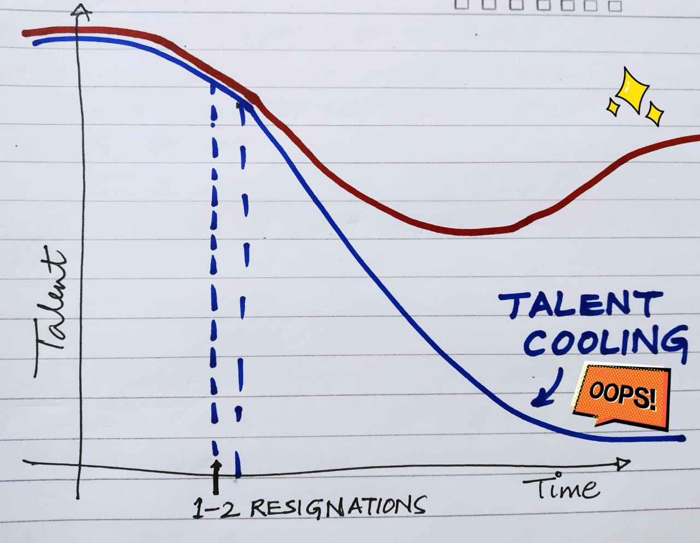

+++
title = "Talent Cooling"
date = 2020-08-14T00:09:00+05:30
tags = ["career", "niranting"]
featured_image = "/images/talent-cooling.jpg"
toc = false
show_reading_time = true
+++

<iframe src="https://niranting.substack.com/embed" width="480" height="320" style="border:1px solid #EEE; background:white;" frameborder="0" scrolling="no"></iframe>

# Talent Cooling Kills Startup Growth

Evaporative Cooling of talent occurs when the most high-value contributors to a community realize that the community is no longer serving their needs anymore and, therefore, leave.

Then something remarkably interesting happens:

> When that happens, it drops the general quality of the community down such that the next most high-value contributors now find the community underwhelming. Each layer of disappearances slowly reduces the average quality of the group until such a point that you reach the people who are so unskilled and unaware of it that they’re unable to tell that they’re part of a mediocre group.

This applies to startups trying to scale/grow as well. For small teams, as little as 1-2 resignations can open a dam of exits.

# Best Engineers are a Guild

A useful mental model to have is this: Engineering is a Guild.

Makers, and particularly software engineers are loosely defined guilds. The guild-like behaviour emerges partially because the best engineers are ~within 3 degrees of each other at any particular given point in time.  The guild decides which companies and offices it wants to support.

Most entrepreneurs and business folks e.g. product managers do not seem to mentally acknowledge the tacit existence of this guild early enough.

# Recognizing Mediocrity

Here is one version of how this story plays out: 

> As you scale, you hire some amazing technology people. Build an engineering team. You build something useful together. 1-2 people quit.But you’re okay. You’ve promoted the people who trained under the expert. That is how you grow “your people”. You’re hiring some senior external talent too!
> 
> After a while, your tech team is unable to ship fast enough and sometimes even your basic hygiene factors like uptime are suffering. “Refactoring” becomes a rallying cry instead of shipped.
> 
> Product is blaming tech, and within tech, different functions e.g. front end vs backend work with varying degrees of distrust.

Here is where things get truly interesting. You’re now actively fighting the Fiery Demon of Talent Cooling. 

The new engineering manager instils a bunch of processes, hires some amazing people and shows a lot of movement. But when you look back 1-2 quarters later, you’re again at the same place: there is no fire in your shipping engine. 

Why? Because **it’s extremely hard for mediocre people to realize that they’re in a mediocrity**.

--- 

Sources/Further Reading:
1. https://web.archive.org/web/20190328104722/http://blog.bumblebeelabs.com/?p=1207 
2. https://medriscoll-com.cdn.ampproject.org/c/s/medriscoll.com/post/9117396231/the-guild-of-silicon-valley/amp
3. If you’re interested in avoiding losing your best tech talent to discomfort and boredom, this is an excellent starting point, written by a practitioner: https://randsinrepose.com/archives/bored-people-quit/